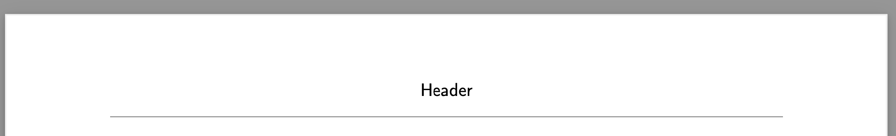

# htmlWebsite2pdf

> [!CAUTION]
> This Library is still in an early state. For use in production, please test it thoroughly and check the results over multiple browsers. You can find [known issues](#known-issues) at the end of this document. Also please check the [prerequists](#prerequisites) and make sure you conform to them. If you find any issues, please report them in the [issues-panel](#).

This library can be used to generate a PDF-Representation from a website or a part of a website. It will go through all the elements and nodes and try to transfer the content to a PDF. Therefor you can use the library to give your users the possibility to download a PDF of your website without the need of the step to generate the PDF-version in other ways. This can be helpful if you have a lot of content or quickly changing content on your website and want to give your users the possibility to download the content for offline-usage. But keep in mind that the library is still in an early state and there can be some issues with the generation.

Also the library has some special features can be used to customize the generated PDF:
- [Page breaks](#how-to-use-page-breaks)
- [Custom page headers and footers](#how-to-use-custom-page-headers-and-footers)
- [Document-Outline](#how-to-use-the-document-outline-feature)
- [Replacements for pagenumbering](#replacements-of-textcontent-of-elements)
- [Internal links](#links-in-the-pdf)

You can find more information about the [special features](#special-features) in the following sections.


## Setup and Usage

1. Check if your website where you want to use this library is compatible with the [prerequisites](#prerequisites).
2. Add the bundled script to your website, you can find it in the `dist` folder:

```html
<script src="./htmlWebsite2pdf.min.js"></script>
```

3. Now you can use the generation-functions in your website. There are two functions available:

- Generate a PDF from the whole body of the website:
  ```javascript
  htmlWebsite2pdf.fromBody(options?);
  ```
- Generate a PDF from a specific element and its children:
  ```javascript
  htmlWebsite2pdf.fromElement(element, options?);
  ```

These is the basic usage of the library. You find more information about [special features](#special-features) in the following sections.

## Prerequisites

### Fonts

The library will go trough your stylesheets and get the needed data of the fonts by the applied Font-Face-Rules. Therefor you should use the `@font-face`-rule to define all your fonts with the fontfile as the source. If you use a font which is not defined with a `@font-face`-rule, the generation will not be successful.
Also the fontfiles must be available in the TrueType-Format (ttf).

Example Font-Face-Rule:

```css
@font-face {
  font-family: 'Roboto';
  src: url('./assets/Roboto-Regular.ttf') format('truetype');
  font-weight: normal;
  font-style: normal;
}
```

### Images
The library supports the most image-formats. But they will be converted to the JPEG-Format in the PDF. Therefor if you have images with a transparent background, they will be converted to a white background. This also applies for inline-svgs.

### Order of the elements
In the generation of the PDF, the library will go through the elements in the order they are in the DOM. Therefor you should be aware of the order of the elements in the HTML. So you will get the best results if you have the elements in the correct order and not use CSS to change the order.

### Not supported HTML-Elements
There are some HTML-Elements which are not supported by the library. If you they get used they will be hidden before the generation of the PDF. This results in a reflow of the elements in the website and can lead to a different layout of the website. But this will only affect the iFrame which is used for the generation of the PDF, the website itself will not be changed sp the user won't notice it.
The following elements are not supported:
- All interactive elements (beside anchors): `button`, `input`, `select`, `textarea`, `label`, `fieldset`, `datalist`, `optgroup`, `option`, `output`, `progress`, `meter`, `dialog`
- Multimedia elements: `audio`, `video`, `track`, `source` and `iframe`
- Script- and style-elements: `script`, `style`
- Other elements: `head`, `meta`, `link`, `base`, `title`, `noscript`, `template`(not if used for headers or footers), `dialog`, `progress`
- All kind of pseudo-elements so `::before` and `::after`-elements and also `::marker`-elements for lists.

If you find any other elements which are not supported, please report them in the [issues](#).

## Options

There are several options available to customize the generated PDF. You can pass them as an object to the generation functions. All of the options are optional. The following options are available:

```javascript
{
  /*
  Margin of each page in the PDF in pt. Can be a number, a four number array or a two number array.
  If a number, the margin will be applied to all four sides of the page.
  If a two number array, the first number will be applied to the top and bottom, the second to the left and right.
  If a four number array, the numbers correspond to the top, right, bottom and left margins respectively (like CSS).
  Default: [0, 0, 0, 0]
  */
  margin: number | [number, number] | [number, number, number, number];
  /*
  The filename of the PDF file.
  Can include the suffix '.pdf', but is not required.
  Default: 'output.pdf'
  */
  filename: string;
  /*
  The title of the PDF file.
  Default: ''
  */
  title: string;
  /*
  The PDF-Version which the output should be compatible with.
  Default: '1.4'
  */
  version: PdfVersion;
  /*
  The size of the pages in the PDF in pt.
  Default: 'A4' => [595, 841]
  */
  pageSize: [number, number] | PageDimensions;
  /*
  Elements which should be ignored based on classnames.
  Default: []
  */
  ignoreElementsByClass: string | string[];
  /*
  Elements which should be ignored based on tag names.
  Default: []
  */
  ignoreElements: string | string[];
  /*
  Whether or not to include custom page headers in the PDF.
  If true, the header has to be defined by a template with the data attribute 'data-htmlWebsite2pdf-header'. For each page with elements which are in the same parentelement as the header, the header will be used on the page.
  Default: false
  */
  usePageHeaders: Boolean;
  /*
  Whether or not to include custom page footers in the PDF.
  If true, the footer has to be defined by a template with the data attribute 'data-htmlWebsite2pdf-footer'. For each page with elements which are in the same parentelement as the footer, the footer will be used on the page.
  Default: false
  */
  usePageFooters: Boolean;
  /*
  Elements which sould get a page break before them based on the tag name.
  Default: []
  */
  pageBreakBeforeElements: string | string[];
  /*
  Elements which sould get a page break after them based on the tag name.
  Default: []
  */
  pageBreakAfterElements: string | string[];
  /*
  Whether or not to generate the Document-Outline for the PDF based on the headings in the HTML.
  If true, the outline will be generated based on the headings and their hierarchy in the HTML. Therefor the headings have to be in the correct order.
  Default: false
  */
  outlineForHeadings: Boolean;
  /*
  The author of the PDF file.
  Default: ''
  */
  author: string;
  /*
  The subject of the PDF file.
  Default: ''
  */
  subject: string;
  /*
  The keywords of the PDF file.
  Default: ''
  */
  keywords: string;
  /*
  The width of the iframe in px which is used for the generation. Should be a size where the input element is the width of the available pagewidth so everything is placed and sized correctly. (pageWidth - marginLeft - margin-Right)
  Default: pageWidth - marginLeft - margin-Right
  */
  iFrameWidth: number;
  /*
  Whether or not a page should be added at the begin of the generation. If the first element to set is in the list of pagebreak-before you should set this to false. Otherwise the firstpage will be a blank page.
  Default: true
  */
  addFirstPage: Boolean;
  /*
  Names of elements which should be avoided to break in the middle of them if there is not enough space on the page. Based on the tag name. If the element is bigger than the page, this option will be ignored. Also lines of text will always be avoided, so there is no need to add paragraphs or spans to this list.
  Default: []
   */
  avoidBreakingElements: string | string[];
  pdfOptions: {
    viewerPreferences: {
      /*
      Whether or not to hide the toolbar.
      Default: false
      */
      hideToolbar: Boolean;
      /*
      Whether or not to hide the menubar.
      Default: false
      */
      hideMenubar: Boolean;
      /*
      Whether or not to hide the window UI, like scrollbars.
      Default: false
      */
      hideWindowUI: Boolean;
      /*
      Whether or not to display the document title instead of the filename.
      Default: false
      */
      displayDocTitle: Boolean;
    };
    /*
    The page mode which should be used in a PDF-Viewer.
    Default: 'UseNone'
    */
    pageMode: PdfPageMode;
    /*
    The layout of the pages when displayed in a PDF-Viewer.
    Default: 'SinglePage'
    */
    pageLayout: PdfPageLayout;
  };
}
```

## Special features

This library has some special features which can be used to customize the generated PDF. The following sections will explain how to use them.

### How to use page breaks

If you want to add a page break before or after a specific element, you can use the `pageBreakBeforeElements` and `pageBreakAfterElements`-options. You can pass a string or an array of strings with the tag names of the elements where you want to add a page break.
If the first element of the generation is in the list of `pageBreakBeforeElements`, you should set the `addFirstPage`-option to `false`, otherwise the first page will be a blank page.
Also you should be aware that the last element of the generation should not be in the list of `pageBreakAfterElements`, otherwise there will be a blank page after the last page.

### How to use custom page headers and footers

If you want to use custom page headers and footers in your PDF, you can use the `usePageHeaders` and `usePageFooters`-options. If you set them to `true`, you have to define the headers and footers in your HTML. The headers and footers have to be defined in a template-element with the data-attribute `data-htmlWebsite2pdf-header` or `data-htmlWebsite2pdf-footer`. The content of the template will be used as the header or footer on the pages where the elements are in the same parent-element as the header or footer.

Example:

```html
<template data-htmlWebsite2pdf-header>
  <div
    style="
    border-bottom: 1px solid black; 
    padding-bottom: 3mm; 
    width: 190mm; 
    text-align: center;"
  >
    <span>Header</span>
  </div>
</template>
```

This would create a header, like you can see in the picture below, with a centered text "Header" and a border at the bottom of the header. If you want to have additional margin between the border and the pagecontents, you should use the CSS-property `margin-bottom`.



If you want to use the current page number in your header or footer, you can use a span-element with a placeholder (see [replacements](#options-for-replacements-of-the-textcontent-of-elements) for more information).

> [!IMPORTANT]
> The headers and footers are placed on a page when the page is added to the PDF, therefor you shouldn't use the following in them:
>
> - Anchors with internal links
> - Elements which are the target of internal links
> - Elements which are the target of a pagebreak
> - If you also use the outline-option: Heading-elements (h1-h6), because they are used for the outline. If you want to use them in the header or footer, you should use the attribute `data-htmlWebsite2pdf-no-outline` on them.
> - Elements with the data-attribute `data-htmlWebsite2pdf-pageNumberById`, which would add the page number of the page with the id of the element.
> - No other elements with the data-attributes `data-htmlWebsite2pdf-header` or `data-htmlWebsite2pdf-footer`.

### How to use the Document-Outline-Feature

If you want to use the Document-Outline-Feature, you can use the `outlineForHeadings`-option. If you set it to `true`, the library will generate a Document-Outline based on the headings in the HTML. The headings have to be in the correct order, otherwise the outline cannot be generated. The outline will be generated based on the hierarchy of the headings in the HTML. This means that you cannot jump from an h1 to an h3 without an h2 in between.

> [!IMPORTANT]
> If the first heading in the input-element (or body, according to the function that is used) is an h3, you cannot use any h1 or h2 later, cause this would break the outline.

Example:

```html
<h1>Heading 1</h1>
<!-- [...] -->
<h2>Heading 1.1</h2>
<!-- [...] -->
<h3>Heading 1.1.1</h3>
<!-- [...] -->
<h2>Heading 2</h2>
<!-- [...] -->
```

This would generate an outline like this:

```
- Heading 1
  - Heading 1.1
    - Heading 1.1.1
- Heading 2
```

> [!TIP]
> If you want a heading to be ignored in the outline, you can use the data-attribute `data-htmlWebsite2pdf-no-outline` on the heading-element. But be aware that your headline-hierarchy has to be correct without the ignored headings.

### Replacements of textcontent of elements

If you want to use the current page number in some places, like in the header or footer, you can use the data-attribute `data-htmlWebsite2pdf-pageNumber`. The library will replace the complete text-content of the element with the current page number.

Example:

```html
<span data-htmlWebsite2pdf-pageNumber>X</span>
```

You can also use the data-attribute `data-htmlWebsite2pdf-pageNumberById` to replace the text-content of the element with the page number of the page with the id of the element. This can be useful for example if you want to create a table of contents with the page numbers of the chapters.

Example:

```html
<span id="chapter1" data-htmlWebsite2pdf-pageNumberById>X</span>
```

This would replace the text-content of the span-element with the page number of the page where the element with the id `chapter1` is placed.

### Links in the PDF

If you want to use links in the PDF, you can use the anchors like you would use it anyways. If you want them to be more visible for the user you can use the following data-attributes for a border around the link:

- `data-htmlWebsite2pdf-borderColor`: The color of the border around the link. Has to be a hex-value. For simpler conversions from values in other formats, you can use the provided [color conversion functions](#conversion-of-color-formats).
- `data-htmlWebsite2pdf-borderStroke`: The width of the border around the link in pt. If omitted but a color is set, the default value is 1pt.

### Helpers

There are some helper functions available to make the usage of the library easier.

#### Pagedimensions

For the `pageSize`-option you can use your own size and pass it as an array with two numbers. If you want to use predefined page dimensions, you can use the following values from the `PageDimensions`-Object:

- Din-formats: `A0`, `A1`, `A2`, `A3`, `A4`, `A5`, `A6`
- US-formats: `LETTER`, `LEGAL`, `TABLOID`, `LEDGER`

#### PDF PageMode
For the `pdfOptions.pageMode`-option you can use the following values from the `PdfPageMode`-enum:
  `USE_NONE`, `USE_OUTLINES`, `USE_THUMBS`, `FULLSCREEN`, `USE_OC`, `USE_ATTACHMENTS`
You can find more information about the values and their effects in the [PDF-Specification](https://opensource.adobe.com/dc-acrobat-sdk-docs/pdfstandards/PDF32000_2008.pdf) on page 74.

#### PDF PageLayout
For the `pdfOptions.pageLayout`-option you can use the following values from the `PdfPageLayout`-enum:
  `SINGLE_PAGE`, `ONE_COLUMN`, `TWO_COLUMN_LEFT`, `TWO_COLUMN_RIGHT`, `TWO_PAGE_LEFT`, `TWO_PAGE_RIGHT`
You can find more information about the values and their effects in the [PDF-Specification](https://opensource.adobe.com/dc-acrobat-sdk-docs/pdfstandards/PDF32000_2008.pdf) on page 73.

#### Conversion of dimensions

The library uses pt as the unit for the dimensions of the PDF. If you want to convert your dimensions from other units (for the margin or something else), you can use the following conversion functions:

##### From cm

- `cm.toPt(cm: number): number`,
- `cm.toPx(pt: number): number`,
- `cm.toInch(pt: number): number`,
- `cm.toMm(pt: number): number`

##### From inch

- `inch.toPt(inch: number): number`,
- `inch.toPx(pt: number): number`,
- `inch.toCm(pt: number): number`,
- `inch.toMm(pt: number): number`

##### From mm

- `mm.toPt(mm: number): number`,
- `mm.toPx(pt: number): number`,
- `mm.toCm(pt: number): number`,
- `mm.toInch(pt: number): number`

##### From px

- `px.toPt(px: number): number`,
- `px.toCm(pt: number): number`,
- `px.toInch(pt: number): number`,
- `px.toMm(pt: number): number`

#### Conversion of color formats

The library uses hex-values for the colors of the borders around the links. If you want to convert your colors from other formats, you can use the following conversion functions. Also it provides more functions to convert between the color formats:

##### From RGB

- `RGB.toRGBHex({r: number, g: number, b: number}): string`
- `RGB.toCMYK({r: number, g: number, b: number}): {c: number, m: number, y: number, k: number}`
- `RGB.toHSL({r: number, g: number, b: number}): {h: number, s: number, l: number}`
- `RGB.changeRange1(r: number, g: number, b: number): {r: number, g: number, b: number}` - Changes the range of the values from 0-255 to 0-1
- `RGB.changeRange255(r: number, g: number, b: number): {r: number, g: number, b: number}` - Changes the range of the values from 0-1 to 0-255

##### From CMYK

- `CMYK.toRGB({c: number, m: number, y: number, k: number}): {r: number, g: number, b: number}`
- `CMYK.toRGBHex({c: number, m: number, y: number, k: number}): string`
- `CMYK.toHSL({c: number, m: number, y: number, k: number}): {h: number, s: number, l: number}`

##### From HSL

- `HSL.toRGB({h: number, s: number, l: number}): {r: number, g: number, b: number}`
- `HSL.toRGBHex({h: number, s: number, l: number}): string`
- `HSL.toCMYK({h: number, s: number, l: number}): {c: number, m: number, y: number, k: number}`

##### From RGB-Hex

- `RGBHex.toRGB(rgbHex: string): {r: number, g: number, b: number}`
- `RGBHex.toCMYK(rgbHex: string): {c: number, m: number, y: number, k: number}`
- `RGBHex.toHSL(rgbHex: string): {h: number, s: number, l: number}`

## Known Issues

#### Images with transparent background
As mentioned in the [prerequisites](#prerequisites), images with a transparent background will be converted to a white background. This also applies for inline-svgs.

#### Backgrounds and Borders of elements
Right now the library will convert styles of elements for borders, backgrounds and shadows to jpg-images. This can lead to a loss of quality and the colors can be different to the original colors. Also this results in a bigger file size of the PDF. Also transparancy is not supported, caused by the conversion to jpg.

This conversion is known to lead sometimes to problemes when using `Safari` as the browser for the generation. We recommend to use `Chrome` for the generation, but your useres will decide which browser they use.

We work on improving this by converting these parts to vector-graphics.

#### CSS Overflow-Propertys
The library does not support the overflow-propertys of CSS. Therefor if you have an element with a fixed height and the content is bigger than the height, the content will be overflowing in the PDF.-Document. This applies to all overflow-propertys beside `overflow: visible`.

#### Long Websites and therefore long PDFs
If you have a long website with a lot of content, the generation of the PDF can take a long time. 
Also right now the pagetree of the pdf-file is only on branch instead of a balanced tree. This can lead to performance-issues in the PDF-Viewer if you have a lot of pages.

#### CSS-Properties
There are a lot of CSS-Properties which are not supported by the library. Therefor the generation can be different to the website. We work on improving the support of CSS-Properties.
CSS-Properties which are known to be not supported right now are:
`overflow`, `z-index`, `text-transform`, `transform`, etc.

If you find any other properties which are not supported, please report them in the [issues](#). Then we will add them to the list of known issues.
We work on improving the support of CSS-Properties.

#### You found an issue?
If you find any issues with the generation of the PDF, please report them in the [issues](#). 
